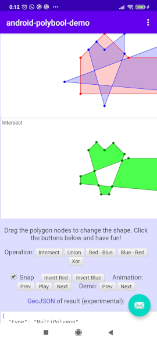

polybool-java
=============

Java port of https://github.com/velipso/polybooljs + Android demo.


This respository contains a single Android project, implementing a demo using the polybool-java library.
For information about the library please visit the original source.


State Changes
=============

The polybool library was transpiled (manually) to Java 8 source code.
It was hard work, but I tried to preserve the code as original as possible.
This way, the Java code can be maintained easily, by comparing it side-by-side (diff)

Due to the nature of Javascript, the Java code relies heavily on lambdas
and on 2 particular utility classes JSMap and JSList to emulate the Javascript language.

The only limitation I found while transpiling the code, was the implementation or lambda recursion,
and not-yet-defined function calls. Fortunately, there is workarounds for this.


Android Demo
============

The Android demo presents an Android WebView that loads a single page /index-java.html.
The content of the page is the original (as in polybooljs), however,
the page does not make use of the original javascript library
but rather the polybool-java library :)

The HTML Javascript calls the Android PolyBoolWebInterface methods to operate on the polygons.
The communication between Javascript and PolyBoolWebInterface is all JSon strings.


Dependencies
============

* Java 8 - Lambdas
* Android Demo requires Api Level 24
* Compiled using Android Studio 4.0.1 and Gradle 6.1.1


Dependencies
============

* Java 8 - Use of Lambdas
* Demo requires Api Level 24


Screenshots
===========




Try it
======

You can install the application in either of these ways:

  * APK: [app-debug.apk](app/build/outputs/apk/debug/app-debug.apk)
  * Source code: clone the repository, compile with gradle and install with adb

```
    export ANDROID_HOME=/home/$USER/Android/Sdk
    ./gradlew assembleDebug
    adb install -r app/build/outputs/apk/app-debug.apk
    adb shell am start -n org.the3deers.polybool.demo/org.the3deers.polybool.demo.MainActivity
```

Open the application. You should see a web page with 2 polygons.
From there you can click on the buttons to perform different boolean operations.


License
=======

MIT License:
Copyright (c) 2016 Sean Connelly (@voidqk, web: syntheti.cc)

MIT License:
Copyright (c) 2020 The 3Deers (Java Port of polybooljs)


